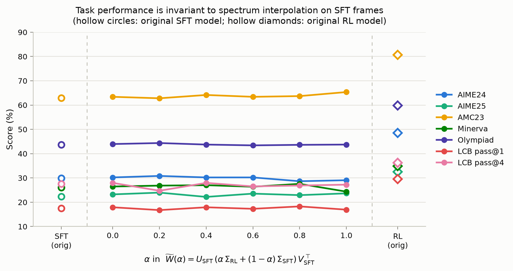

# SFT U/V + Σ 插值实验（论文 Figure 3 的镜像对照）

> 状态：**最终结果**（2026-07-14 03:00 UTC，全部 8 模型 × 7 指标完成）。

## 实验设置

对每个 2D 权重矩阵：

$$\widetilde{W}(\alpha) = U_{\text{SFT}}\,\bigl(\alpha\,\Sigma_{\text{RL}} + (1-\alpha)\,\Sigma_{\text{SFT}}\bigr)\,V_{\text{SFT}}^{\top},\qquad \alpha\in\{0,0.2,0.4,0.6,0.8,1.0\}$$

- **U/V（奇异框架）固定取自 SFT 模型**：`deepseek-ai/DeepSeek-R1-Distill-Qwen-1.5B`
- **Σ 在 SFT 谱与 RL 谱之间线性插值**，RL = `nvidia/Nemotron-Research-Reasoning-Qwen-1.5B`（ProRL，~3k RL steps，从 R1-Distill 训练而来）
- α=0 → 原 SFT 模型（sanity 端点）；α=1 → SFT 框架 + 完整 RL 谱
- 与论文 Figure 3（U/V 取 RL、Σ 向 base 谱插值）互为镜像对照
- 198 个 2D 矩阵全部 blend（含 embed/lm_head）；1D 参数（bias/LayerNorm，141 个）保持 SFT 原值
- blend 在 fp32 下计算、bf16 存盘；α=0 重构相对误差 ≤ 1.3e-4

**谱漂移观测**：Σ_SFT ↔ Σ_RL 的相对漂移 ‖ΔΣ‖/‖Σ‖ 在全部 198 个矩阵上为 **0.00%–0.04%**，与论文 Fig 2 的 RL near-isospectral 结论一致（SFT 阶段为 ~5%）。

## 评测协议

- **Math**（POLARIS 流程，`eval_vllm.py` + `grade.py`）：AIME24/25 (Mean@32)、AMC23 (Mean@8)、Minerva/Olympiad (Mean@4)；t=1.0, top_p=0.8, max_len=32768
- **Code**（ArcherCodeR 流程，verl `main_generation`，测试用例真实执行）：LiveCodeBench v5 全量 279 题，n=4, t=0.8, response 32k → pass@1 / pass@4
- 参考端点：`sft_orig`（R1-Distill 原版）与 `rl_orig`（Nemotron 原版）跑完全相同的协议

## 最终结果（%）

| 模型 | AIME24 | AIME25 | AMC23 | Minerva | Olympiad | LCB p@1 | LCB p@4 |
|---|---|---|---|---|---|---|---|
| **sft_orig** | **29.90** | **22.40** | **62.95** | **26.10** | **43.70** | **17.56** | **27.60** |
| alpha_0.0 | 30.21 | 23.23 | 63.40 | 26.47 | 43.96 | 17.92 | 27.96 |
| alpha_0.2 | 30.83 | 23.96 | 62.80 | 26.84 | 44.37 | 16.76 | 24.73 |
| alpha_0.4 | 30.21 | 22.19 | 64.16 | 27.02 | 43.74 | 17.92 | 27.96 |
| alpha_0.6 | 30.21 | 23.54 | 63.40 | 26.38 | 43.41 | 17.29 | 26.52 |
| alpha_0.8 | 28.65 | 22.92 | 63.70 | 27.57 | 43.63 | 18.28 | 26.88 |
| alpha_1.0 | 29.06 | 23.65 | 65.36 | 24.36 | 43.74 | 16.94 | 27.24 |
| **rl_orig** | **48.54** | **32.50** | **80.72** | **34.93** | **59.81** | **29.48** | **36.20** |

（AIME24/25 = Mean@32，AMC23 = Mean@8，Minerva/Olympiad = Mean@4，LCB = pass@k）

**α 扫描的极差（max−min）**：AIME24 2.2pp、AIME25 1.8pp、AMC23 2.6pp、Minerva 3.2pp、Olympiad 1.0pp、LCB p@1 1.5pp —— 全部落在各自 Mean@n 的采样噪声量级内，且围绕 sft_orig 水平无方向性。

## 结论

1. **性能对 Σ 插值不变**：在 SFT 的奇异框架上把 RL 谱以任意比例换入，7 个指标全部钉在 SFT 水平（见图，α 扫描全线平坦）。
2. **Sanity 通过**：alpha_0.0 与 sft_orig 的差异 ≤0.8pp（7 指标平均 ~0.3pp），SVD 分解-重构-bf16 存盘管线对模型无损。
3. **RL 增益由奇异框架（U/V）携带**：rl_orig 比 α 扫描的所有模型高 AIME24 ~18pp、AMC23 ~16pp、Olympiad ~16pp、LCB p@1 ~12pp；结合谱漂移仅 ≤0.04% 的观测，RL 的行为改进几乎完全存在于 U/V 的旋转中，谱的贡献可忽略。
4. 与论文 Figure 3 / Section 3.2 形成**双向证据**：那边是"RL 框架 + 换谱不掉分"，这边是"SFT 框架 + 换谱不涨分" —— 两个方向都指向 useful RLVR progress is carried by singular-frame motion, not spectral rescaling。

## 复现入口

- Blend 脚本：`replace/blend_sft_uv.py`（注意：修复了 `replace.py` 的 state_dict 与模型参数共享存储的 bug —— 原脚本多 α 循环中 `load_state_dict` 会污染源谱，除首个 α 外结果均错误；同时每层 SVD 只算一次供全部 α 复用）
- 画图：`sft_uv_blend/scripts/plot_alpha_sweep.py` → `replace/alpha_sweep_sft_uv.png`
- 模型与日志：`~/workspace/rl-opt-proj/sft_uv_blend/{models,svd_logs,eval_outputs}/`
- 运行编排：`sft_uv_blend/scripts/`（`supervisor.sh` 自愈重启 + `steal_loop.sh` / `boost_*.sh` 空卡 work-stealing + `collect_results.py` 汇总）
- 评测补丁：`POLARIS/scripts/eval/eval_vllm.py` 已修复 worker 覆盖外部 `CUDA_VISIBLE_DEVICES` 的问题（多模型并行时会全部挤到 GPU 0）
- 算力：k8s pods `zhizhousha-rlopt-fig3-8gpu`（8×H100）+ `zhizhousha-rlopt-fig3-5gpu-b`（5×H100，LCB/olympiad 加速）

## 交付与清理（2026-07-14）

**交付物**（本 repo，`hanq` 分支）：
- `RESULTS_sft_uv_sigma_interp.md` —— 本文档（设置、协议、完整表格、结论、复现入口）
- `alpha_sweep_sft_uv.png` —— Figure-3 风格 α 扫描图（空心圆 = SFT 原版，空心菱形 = RL 原版）
- `blend_sft_uv.py` —— blend 脚本（含 replace.py 跨 α 污染 bug 的修复）

**运行统计**：总计约 85 GPU·小时（13×H100 峰值并行）；每个 R1-Distill 系模型 math 全套 ~8-10h/卡（long-CoT 大量逼近 32k 上限），Nemotron 仅 ~4h —— RL 模型生成显著更短这一现象本身与论文结论自洽。

**清理状态**：两个实验 pod 已删除；6 个 blend 模型（bf16, 各 3.4G）、全部生成 jsonl/parquet、逐层 sigma 日志保留在 `~/workspace/rl-opt-proj/sft_uv_blend/`，可随时复算或加密度补点（如 α∈{0.1,...,0.9} 或更多 RL checkpoint 对）。

**⚠️ Infra 事故记录（建议上报）**：节点 `research-common-h100-087` 于 2026-07-13 23:19 UTC 发生"K8s 显示 Ready / 无污点标记，但 `kubectl exec` 无响应、节点上全部用户进程同时冻结"的故障，持续至少 2 小时未自愈；当时损失 4 个跑至 ~98% 的 olympiad 生成 + 1 个 LCB 打分阶段，已全部在 pod B 重跑补齐，数据无损失。
